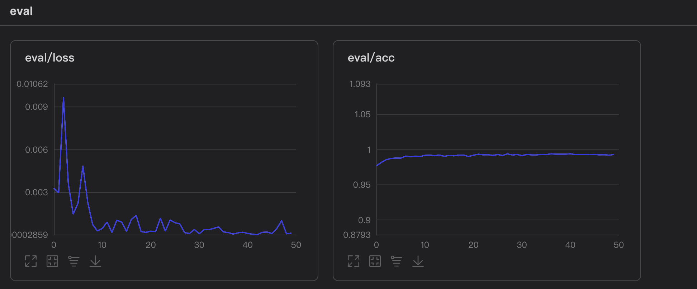

# 所做工作

1. 搭建自己的神经网络：

```python
class MyNet(paddle.nn.Layer):
    def __init__(self):
        super(MyNet, self).__init__()
        self.conv1 = paddle.nn.Conv2D(1, 10, kernel_size=5)
        self.conv2 = paddle.nn.Conv2D(10, 20, kernel_size=5)
        self.conv2_drop = paddle.nn.Dropout2D()
        self.fc1 = paddle.nn.Linear(500, 256)
        self.fc2 = paddle.nn.Linear(256, 10)

    def forward(self, x):
        x = paddle.nn.functional.relu(paddle.nn.functional.max_pool2d(self.conv1(x),2))
        x = paddle.nn.functional.relu(paddle.nn.functional.max_pool2d(self.conv2_drop(self.conv2(x)),2))
        x = paddle.reshape(x,[-1,500])
        x = paddle.nn.functional.relu(self.fc1(x))
        x = self.fc2(x)
        y = paddle.nn.functional.log_softmax(x)
        # print(y)
        return y
```

2. 测试不同的优化方法，包括SGD/Momentum/Adam/Adagrad/Rmsprop，画出验证集test_dataset的acc和loss曲线。

1. SGD优化方法测试集acc和loss曲线图


2. Momentum 优化方法测试集acc和loss曲线图



3. Adam优化方法测试集acc和loss曲线图


4. Adagrad优化方法测试集acc和loss曲线图


5. Rmsprop优化方法测试集acc和loss曲线图


通过比较acc得出，Momentum表现得更好一点，所以最优模型参数选择Momentum训练出来的模型。测试结果见 notebook中
