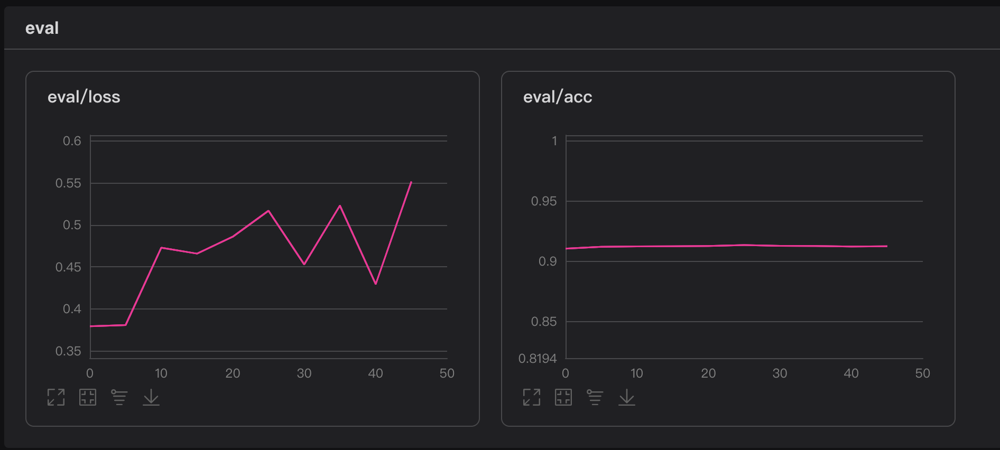

# 作业所做工作说明：

尝试采用不同的网络模型训练，并且探究了不同超参数，优化器对最终训练结果的影响

1. 首先我采用老师上课所说的经典CNN 模型LeNet，在Adam优化器，lr=0.001上进行模型训练,  得到baseline 结果。

```python
from paddle.vision.models import LeNet
model = paddle.Model(LeNet())
lr = 0.001
optimizer = paddle.optimizer.Adam(learning_rate=lr, parameters=model.parameters())
model.prepare(paddle.optimizer.Adam(learning_rate=0.001, parameters=model.parameters()),
              paddle.nn.CrossEntropyLoss(),
              paddle.metric.Accuracy())
log_dir = './log/LeNet_Adam'
if not os.path.exists(log_dir):
    os.makedirs(log_dir)
callback_train = paddle.callbacks.VisualDL(log_dir=log_dir)

model.fit(train_dataset, test_dataset, epochs=50, batch_size=64, verbose=1, callbacks=callback_train)
```

LeNet_Adam：


采用不同的优化器和学习率进行模型的优化，发现并不能起到很大的优化效果模型正确率总是在0.89~0.9之间浮动，一直超过不了0.9。从损失函数看训练稳定性不够。

2. 自己实现一个多层的CNN网络模型，并且尝试了多个优化器和学习率进行优化，最终发现在采用Momentum优化器，并且学习率取0.001时，能够取得最高的准确率，batch_size=64, epoch=50：

模型结构：

```python
class MyNet(paddle.nn.Layer):    
    def __init__(self):
        super(MyNet, self).__init__()
        self.layer1 = NN.Sequential(   
            NN.Conv2D(1, 16, kernel_size=5, padding=2),
            NN.BatchNorm2D(16), 
            NN.ReLU()) #16, 28, 28
        self.pool1=NN.MaxPool2D(2) #16, 14, 14
        self.layer2 = NN.Sequential(
            NN.Conv2D(16, 32, kernel_size=3),
            NN.BatchNorm2D(32),
            NN.ReLU())#32, 12, 12
        self.layer3 = NN.Sequential(
            NN.Conv2D(32, 64, kernel_size=3),
            NN.BatchNorm2D(64),
            NN.ReLU()) #64, 10, 10
        self.pool2=NN.MaxPool2D(2)  #64, 5, 5
        self.fc = NN.Linear(5*5*64, 10)
        
    def forward(self, x):
        out = self.layer1(x)
        out=self.pool1(out)
        out = self.layer2(out)
        out=self.layer3(out)
        out=self.pool2(out)
        out = paddle.reshape(out,[-1,5*5*64])
        out = self.fc(out)
        return out
```


最高的准确率模型 myNet_Mom（准确率：0.907）：


MyNet_SGD:


MyNet_SGD (lr=0.01):


3. 继续进行模型优化，由于自己定义的网络达到的正确率只稍微好一点，也没有很大的提升，通过自学，采用resnet-18进行模型的预测，其他超参数为 Adam，lr=0.001。最高的正确率为0.913。


resnet18在验证集的正确率：

```
Eval begin...
step 10000/10000 [==============================] - loss: 6.0338 - acc: 0.9083 - 10ms/step        
Eval samples: 10000
{'loss': [6.033785], 'acc': 0.9083}
```

resnet18的损失曲线和正确率曲线：


4. 继续进行模型的优化，采用resnet50，进行模型的训练，由于第一次采用不同的优化器发现Momentum优化器的效果不错，所以在最后采用resnet50的模型上对这种两种优化器都进行了训练，最后在Momentum上，训练的结果更好。正确率能够超过0.91。

训练过程损失和最高准确率率曲线图：

Resnet50_Adam（最高准确率0.9099）:  


Resnet50_Mom(最高准确率91.34)：



