# 本次作业所做工作

1. 按照助教老师所给代码，理解逻辑后，写出一个pytorch版本的代码解决方案，具体代码见 notebook

2. 实现一个复杂的CNN网络，具体的网络结构图一，并且采取上课老师所说的一些数据增强技术，包括**图片随机翻转**，**图片随机旋转**。并且我仔细观察了数据集中的数据，发现大部分图片其实是512x512像素大小，几乎所有图片都大于128x128大小，这样我为了能够输入到更多的数据，在resize图片时候，采取的大小是(3x128x128) 。由于是分类任务，所以loss函数采用的是交叉熵损失，并且采用多种优化器进行试验。

   pytorch 中的Adam是结合了Momentum和RMSprop，并进行了偏差修正。实验也发现 采用Adam优化器的训练能够在测试中获得更好的准确率，准确率为：***0.7420918367346939***

#### 图一：模型结构

   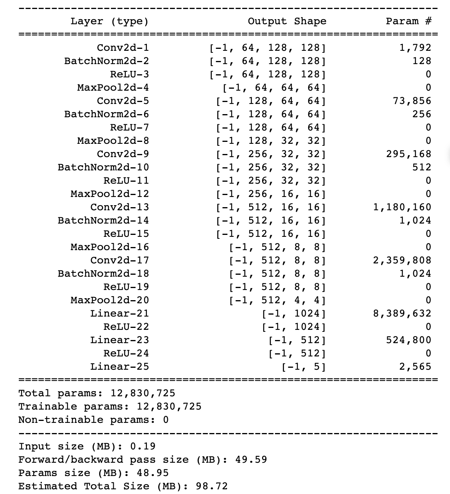

实验结果如下：

图二：MyCNN_acc_loss_adam

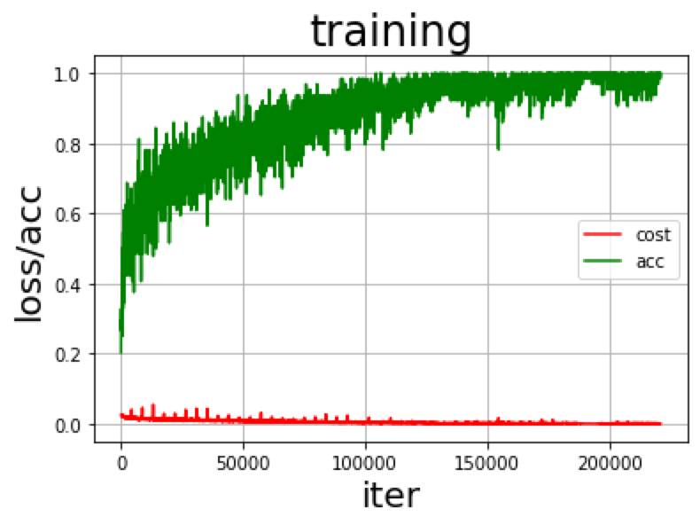

```python
final test acc:  0.7420918367346939
```

MyCNN_acc_loss_SGD 训练过程中训练和测试的图像：

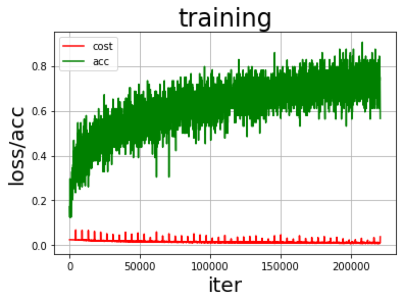

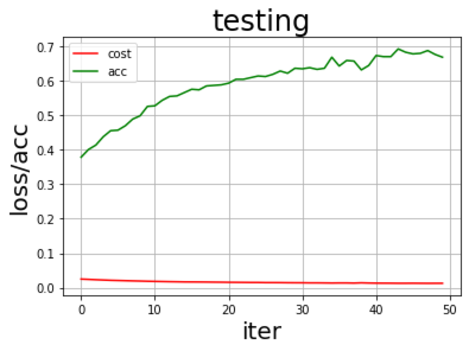

test acc:  0.6673469387755102

3. 在上述模型训练之后，我又采用老师上课所提到的**注意力机制**（放到了残差块前面进行注意力学习）、**dropout**（提高泛化能力）技术以及上次作业所采用的**Resnet18**并且同时采用了前一种训练方式所提到的**图像增强**技术、以及**多种图片resize方式的采样技术** 来对模型进行优化和提升：

   模型结构（由于模型太长了，就不全部放上来了，具体代码见 notebook）：

   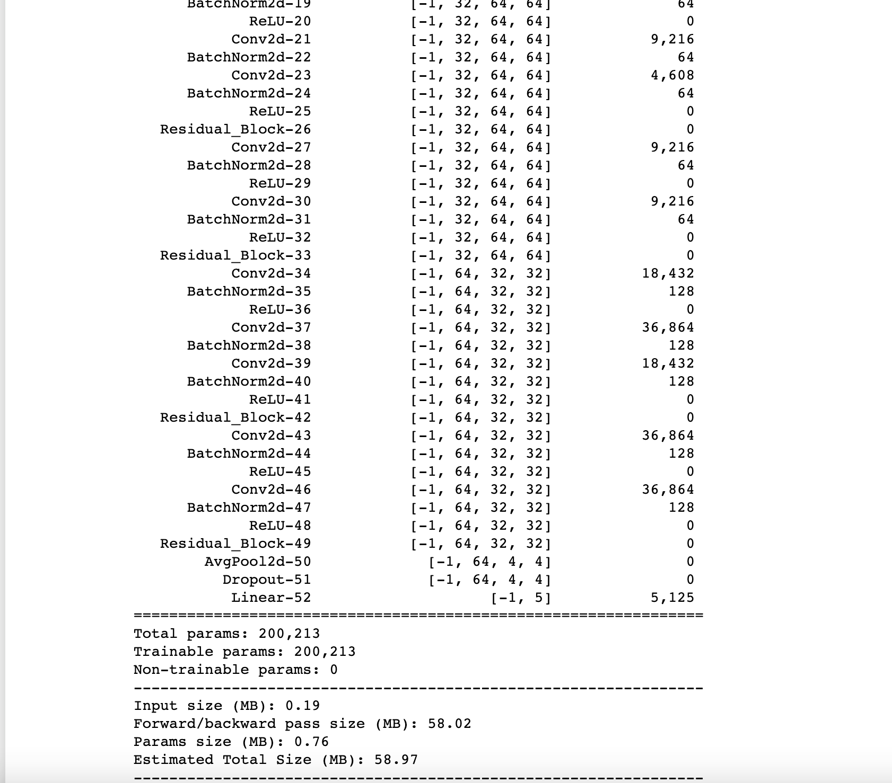

使用实验室GPU训练模型截图：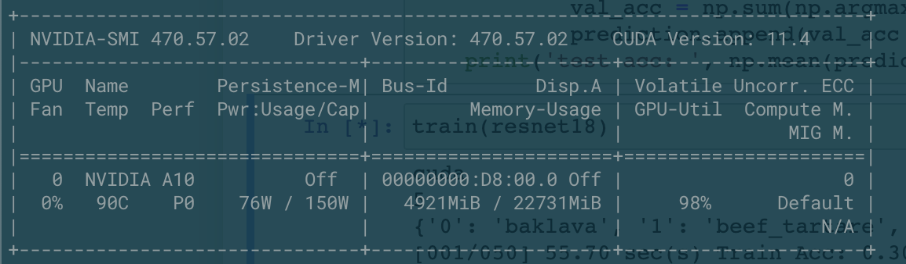

训练50次后测试得到的正确率为0.7470344387755101，训练过程的图像如下所示：

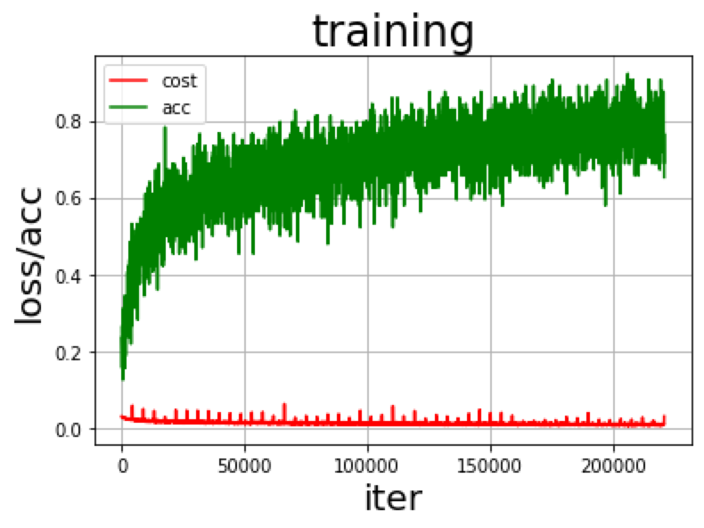


在训练了50个epoch之后，我对训练过程的图像进行分析，我看到训练过程中的图片，准确率还是一直往上上升，这表明我们的resnet18网络其实还没有收敛，还有提高的空间，可以继续训练，所以我又在实验的服务器上进行后续的实验，我提高训练的epoch到100。得到如下图像，由于使用iter作为训练的横坐标看起来十分的稠密，所以我后面统一采用epoch作为训练过程图像的横坐标。最终的准确率为 73.03%。可以看到在最后训练的过程中，在训练集上一届开始过拟合了，在测试集上，准确率还是接近75%左右徘徊。


```
test acc:  0.7503252551020408
```

resnet18_train_100:

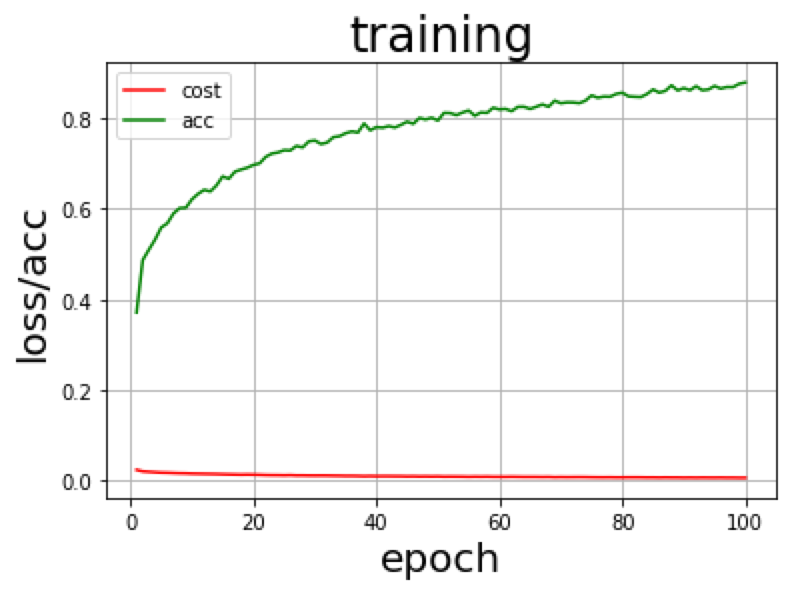

resnet18_test_100:

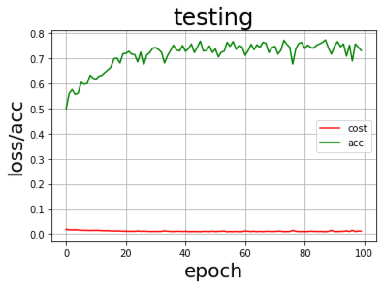

3. 在群中和同学交流训练心得之后，采取**数据增广的技术**（Augment）来增强训练集的大小，然后再使用第二步中所采用的优化技术和网络结构进行训练:

增加数据集 Augment 增广:

```python
p = Augmentor.Pipeline()
p.random_contrast(probability=0.5, min_factor=0.3, max_factor=0.8)
p.random_brightness(probability=0.5, min_factor=0.5, max_factor=1.0)
p.zoom(probability=0.5, min_factor=1.01, max_factor=1.03)
p.random_distortion(probability=0.5, grid_height=3, grid_width=3, magnitude=6)
p.skew(probability=0.5, magnitude=0.12)
p.random_erasing(probability=0.5, rectangle_area=0.11)
p.rotate(probability=0.5, max_left_rotation=4, max_right_rotation=4)
```

```python
test acc:  0.758577806122449
```

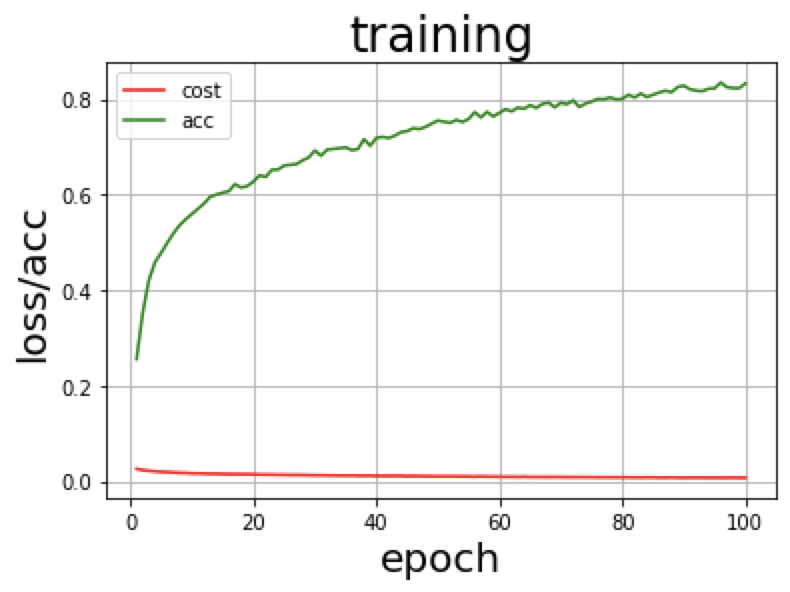

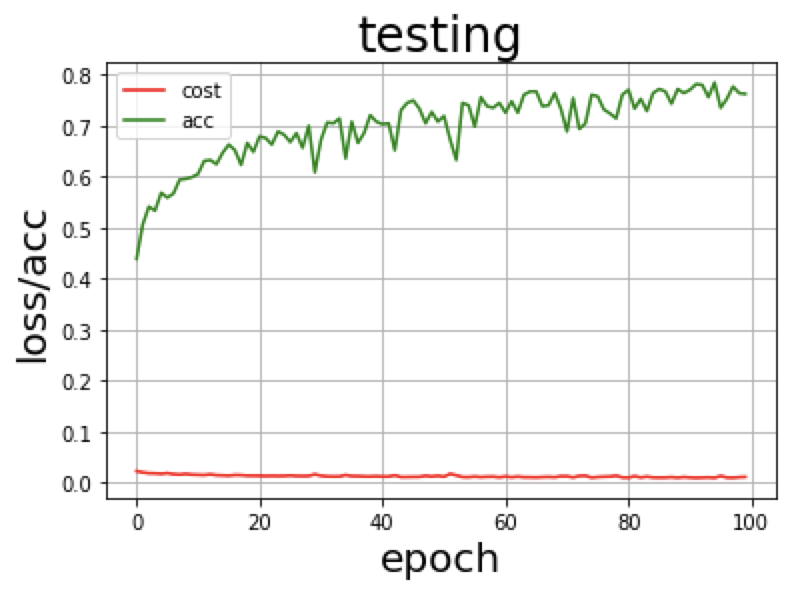

最后，我又试了一下150个epoch训练，发现最终还能够提升一点效果，但是提升不是太明显，最终模型的准确率为 ***0.764800***

```
test acc: 0.764800
```
