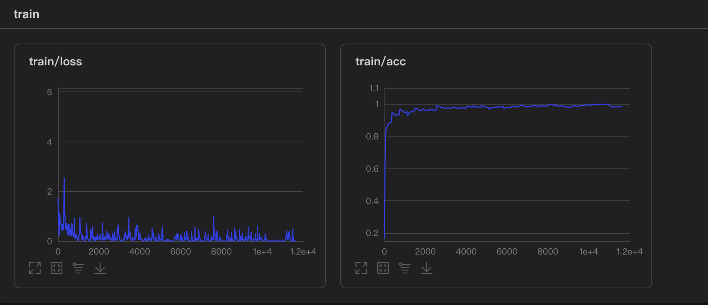
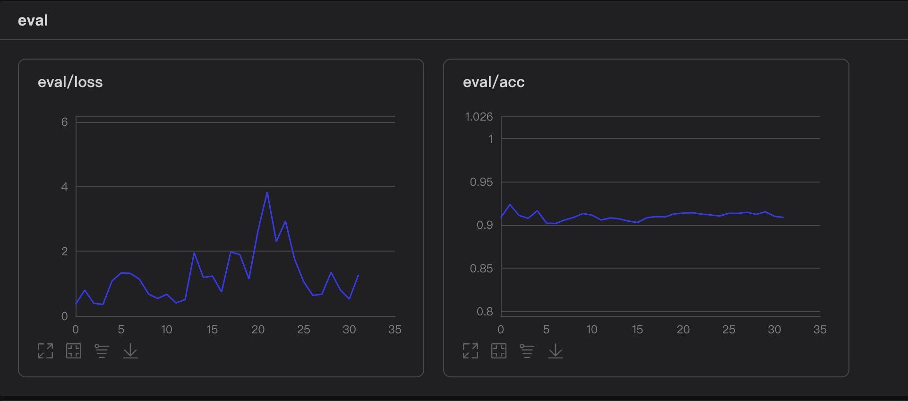
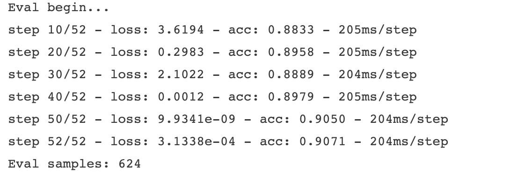
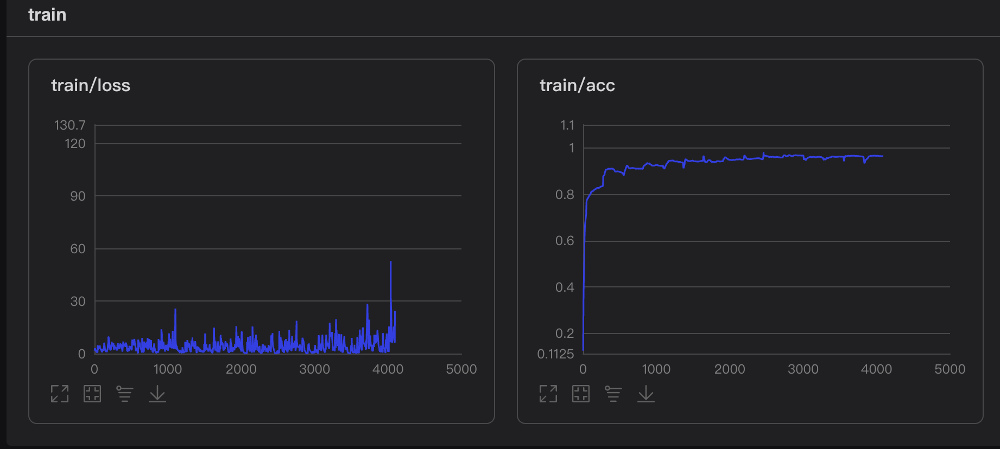
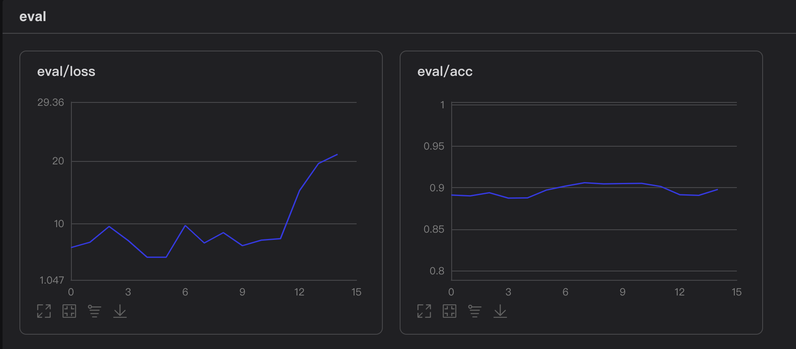
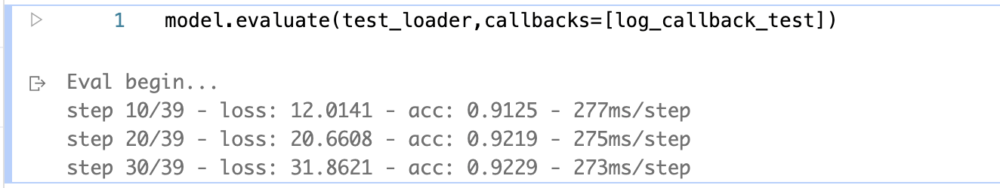

# 本次作业所做工作：

​	首先我复习老师上课所教授的ViT模型的原理与网络结构，

将ImageNet上预测的Vit模型迁移至美食分类的任务上。具体的迁移学习方法是，在训练过程中，固定住原始在ImageNet训练好的Vit网络模型前面部分，只让最后的全连接层的参数进行随机梯度下降的训练。这里有多个方案，比如说选择最后一层全连接层，还是最后n层进行fine tune。经过我自己在网上的学习，通常来说一般来说是只训练最后1层或者最后10层等方法。我首先尝试了只fine ture最后一层的结果，然后打算再尝试训练最后的全连接层+新全连接层的方法。第二种方法，我采用添加一层全连接层512，然后再进行训练。

由于训练实在是很耗费时间，使用网页版的jupyter很容易训练一般失去响应，白费了很多GPU的使用时间。后来我使用了paddle的任务功能，后台训练了32个epoch，就发现没有了GPU使用时间。 第二周才使用自己添加一个全连接层的方法，并且进行了实验。

### 训练过程的损失函数和准确率变化趋势：

fine tune 最后一个全连接层：

添加一个512的全连接层，即fine tune 最后连个全连接层：

## 结论：

从训练过程的loss以及acc的收敛速度可以看到，在使用了预训练模型之后，模型的训练其实很快就能够收敛，在测试集上进行验证时，模型的准确率在90%波动，这可能是由于只训练最后一层的原因，在添加了一个linear层后，我发现训练结果得到了一定的提升，可以看到就是针对特定的任务，我们可以通过预训练达到一个很好地效果，但是如果想要继续提升，就要针对这个问题进行一些微调。

最终正确率： 0.9229

